# CoffeeChain-CFC

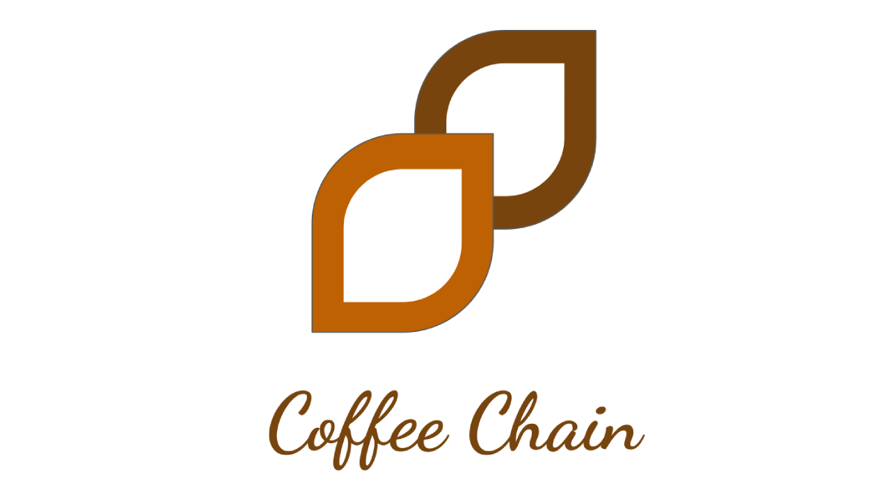

WebPage: https://coffee-chain-deploy-cfc.mybluemix.net/
REDES DE COFFEE CHAIN

  
INDEX:

  
# Index:

- [CoffeeChain-CFC](#coffeechain-cfc)
- [Index:](#index)
- [Introduction:](#introduction)
- [Problem:](#problem)
- [Solution:](#solution)
  - [DEMO:](#demo)
  - [How it Works:](#how-it-works)
  - [Cloudant:](#cloudant)
  - [API and Actions:](#api-and-actions)
  - [Chatbot:](#chatbot)
  - [Toolchain (CI/CD):](#toolchain-cicd)
  - [Solana Blockchain Integration:](#solana-blockchain-integration)
  - [Rapyd Integration:](#rapyd-integration)
- [Deployment/Traction:](#deploymenttraction)

# Introduction:

DOK

# Problem:

DOK

# Solution:

## DEMO:

Video: Click on the image

## How it Works:

Toda la plataforma estab primordialmente basada en servicios de IBM Cloud.

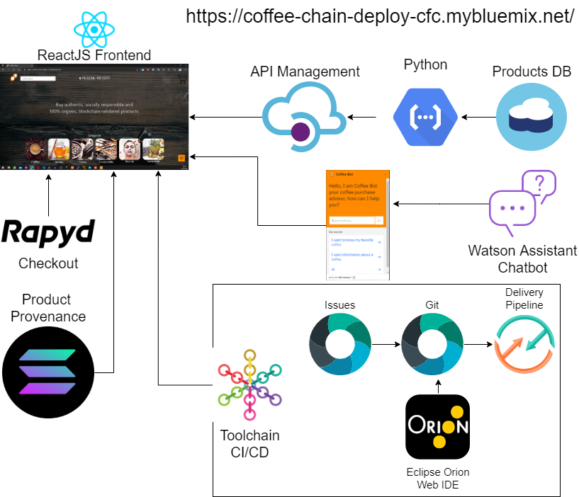

1. La aplicacion almacena los datos de los productos mediante una DB Cloudant.[Details](#cloudant)
2. La base de datos es leida por la pagina web a travez de una API ejecuta una Cloud Function basada en Python para realizar el Query de la DB.[Details](#api-and-actions)
3. Nostros Embed el chabot en el website a travez de la la Web Chat integration de IBM como un scipt.[Details](#chatbot)
4. La pagina web esta desplegada mediante un el ciclo de CI/CD gracias a una IBM toolchain.[Details](#toolchain-cicd)
5. La pagina verifica el provenance de los productos al leer los datos en la red de Solana.[Details](#solana-blockchain-integration)
6. La aplicacion puede realizar el checkout del carrito mediante las API's de Rapyd.[Details](#rapyd-integration)

NOTA: Si deseas replicar este proyecto requieres tener una cuenta activa en IBM Cloud.

[IBM Cloud Create Account](https://cloud.ibm.com/registration)

## Cloudant:

Por facilidad y rapidez de implementacion, se decidio que una base de datos no relacional era lo ideal para este proyecto y para almacenar los productos de la plataforma.

La base de datos fue proporcionada por la empresa [Obio](https://www.obioorganico.com/), los productos mostrados en la plataforma son productos reales de productores mexicanos.

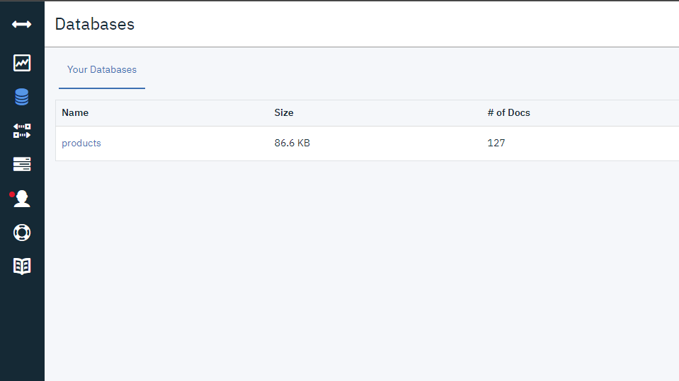

Los documentos guardados en la DB de los productos son los siguientes.

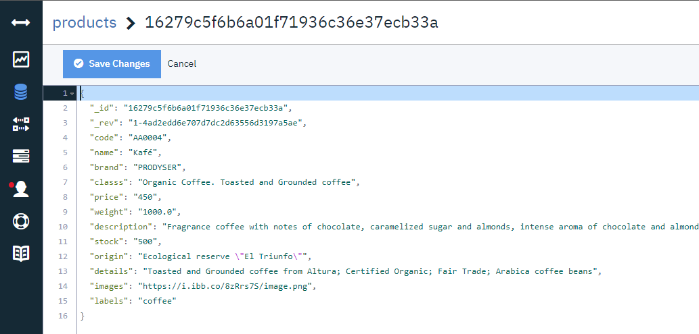

## API and Actions:

Para poder consumir la base de datos en la pagina web de forma segura se implemento una API.

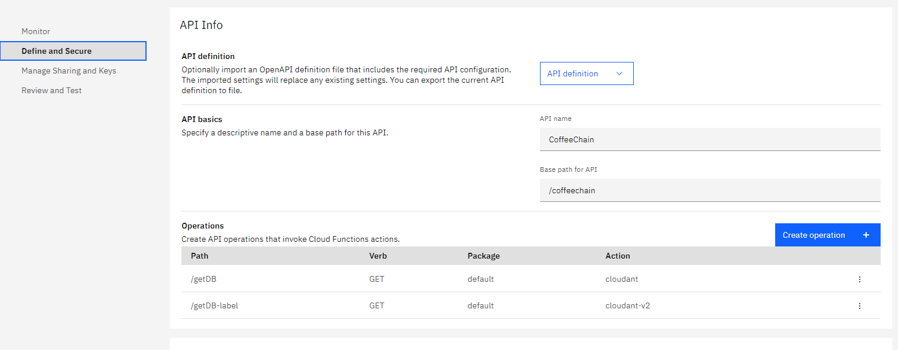

Cada ruta de la api esta ligada a una action, la cual tiene como fin obtener toda la base de datos u obtener solo una parte con un query, ambas se implementaron con un runtime Python 3.7 gracias a su facilidad de uso, dejamos el ejemplo de como realizamos el query de una parte de la DB.

/getDB-label

    from ibmcloudant.cloudant_v1 import CloudantV1
    from ibm_cloud_sdk_core.authenticators import IAMAuthenticator

    authenticator = IAMAuthenticator('XXXXXXAPI_KEYXXXXXX')

    service = CloudantV1(authenticator=authenticator)

    service.set_service_url('https://XXXXX-XXXXXXXx-XXXXXX-XXXXXX-bluemix.cloudantnosqldb.appdomain.cloud')

    def main(params):
    response = service.post_find(
        db='products',selector={
        "_id": {
            "$gt": "0"
        },
        "labels": {
            "$eq": params["__ow_headers"]["label"]
        }
    },
        fields=["code", "name","brand","classs","price","weight","description","stock","origin","details","images","labels"]
    ).get_result()

    return({"data":response["docs"]})

Esta API es ejecutada cada vez que seleccionamos en la aplicacion una categoria de productos.

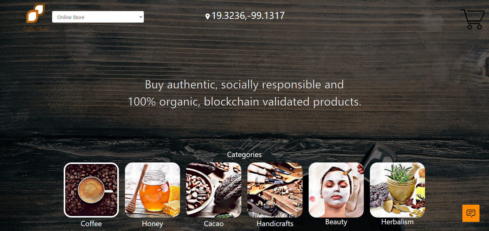

Si seleccionamos por ejemplo la honey, la action realizara solo el query de los productos que tengan como label honey.

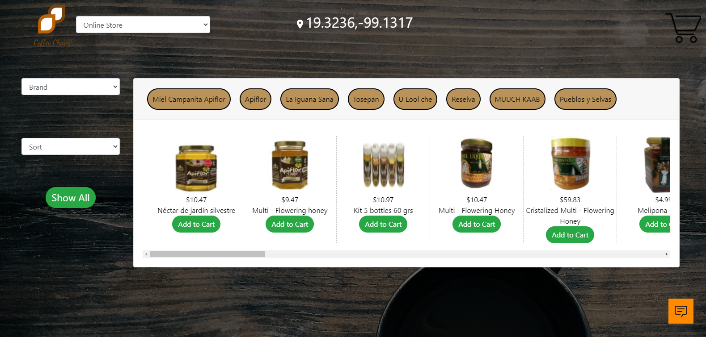

## Chatbot:

El chatbot fue completamente implementado mediante Watson assistant.

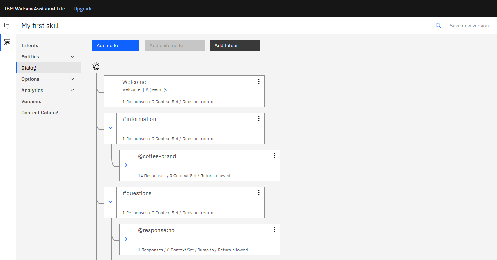

Este esta desplegado en la pagina web y puedes probarlo sin ningun problema.

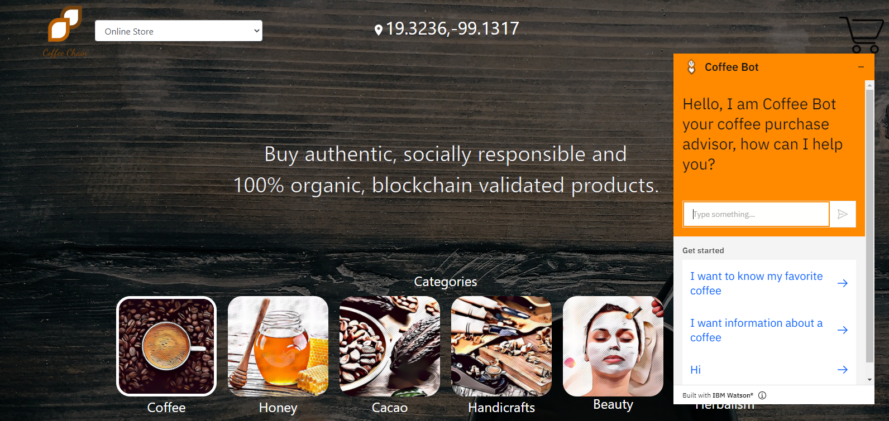

Tiene como funciones principales dar informacion sobre las marcas de cafe.

- Para activar este Intent porfavor esciba en el chatbot alguna de las siguientes frases o similares.

  - Ask for coffee information
  - I want information about a coffee
  - Coffee information

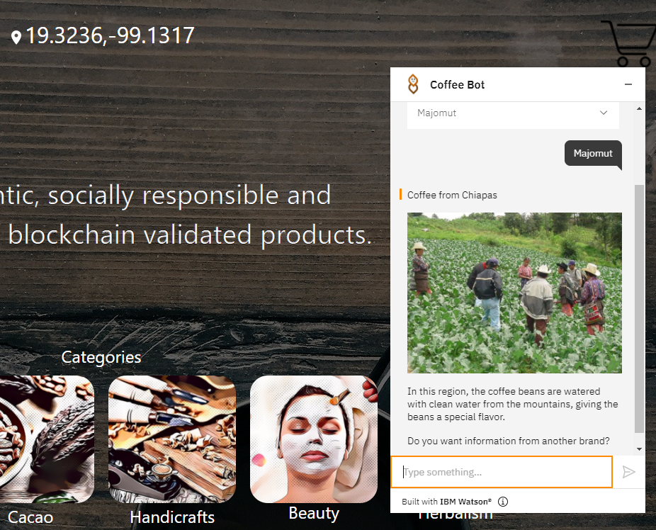

Otra de sus funciones es realizar un test para obtener el cafe ideal segun tus gustos.

- Para activar este Intent porfavor esciba en el chatbot alguna de las siguientes frases o similares.

  - Coffee test
  - I want to know my favorite coffee
  - Test

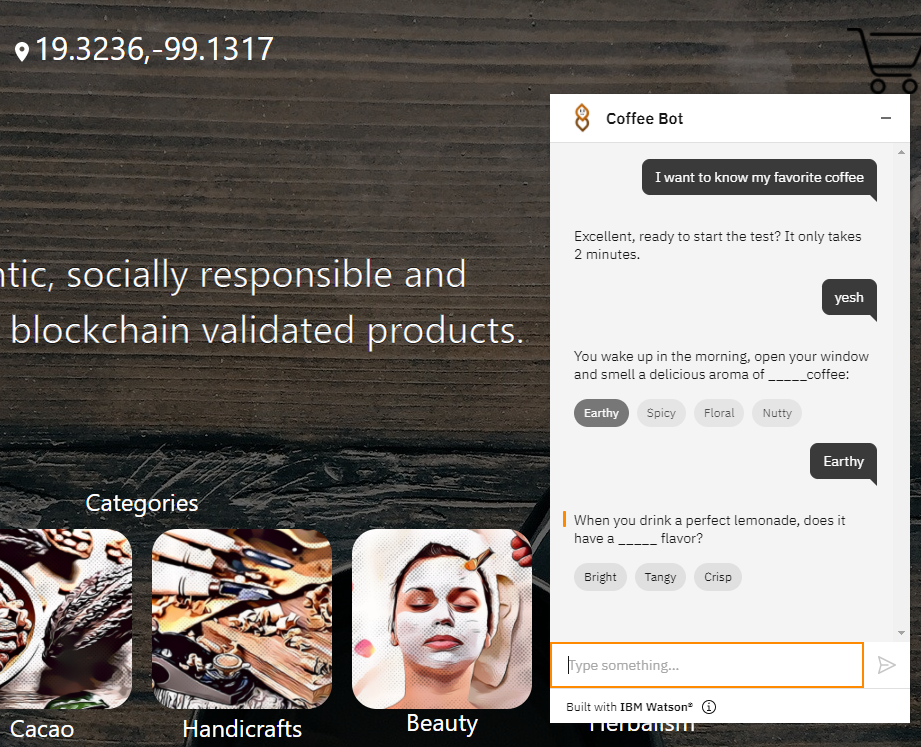

## Toolchain (CI/CD):

Para poder desplegar la pagina y que pudiera ser utilizada por cualquier persona en el mundo se desplego siguiendo la metodologia CI/CD gracias a una toolchain de IBM.

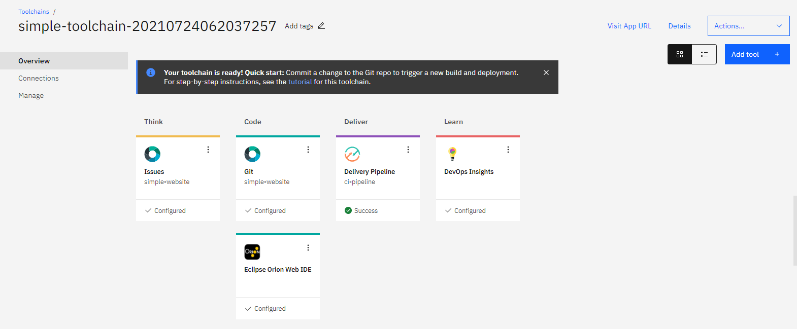

Todo el control de versiones se realizo mediante un repositorio alojado en IBM.

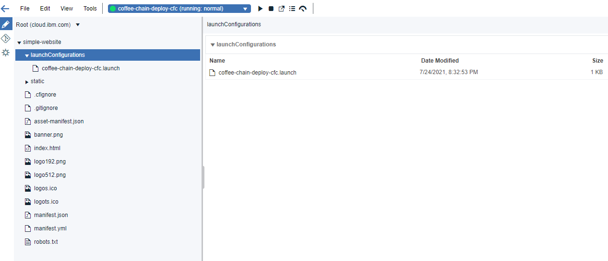

Todo el desarrollo del frontend fue realizado con el framework ReactJS.

[WebPage](https://github.com/altaga/CoffeeChain-CFC/tree/main/Website)

## Solana Blockchain Integration:

La pagina web puede leer los datos directamente de la blockchain de solana para buscar el registro de cada prodcuto mediante su signature, el cual esta encoding en un QR para poderlo leer facilmente con la plataforma.

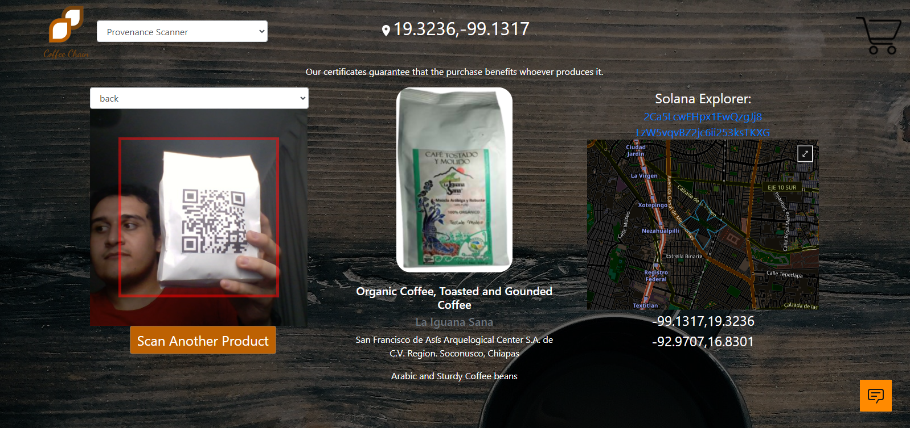

La lectura y escritura sobre la blockchain se hace atravez de la API de Solana.

explorer-api.devnet.solana.com

Esta seccion de la pagina tiene 3 secciones fundamentales.

- El escaner de los codigos QR.

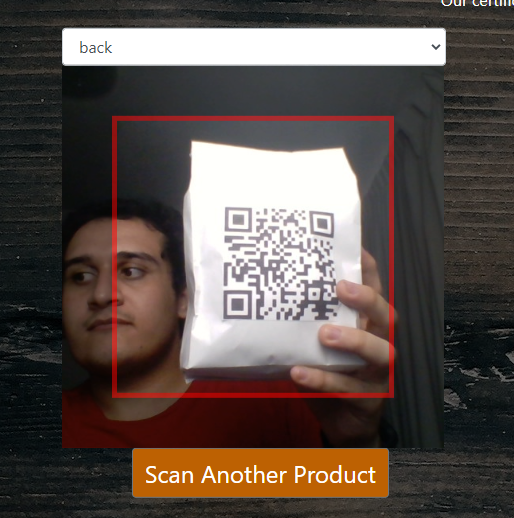

- La informacion cargada desde la blockchain, la cual incluye los checkpoints, imagen, marca y demas informacion relacionada con el producto
  
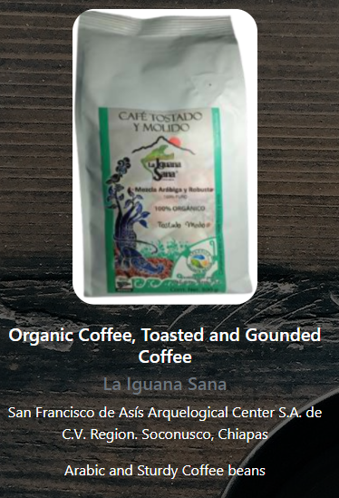

- El mapa que tiene como fin poder ver las ubicaciones donde ha estado el producto haciendo checkpoint en la cadena de distribucion, ademas sobre el tendremo un link al explorer de la blockchain para poder ver la informacion cargada en ella directamente, cabe decir que esta informacion es permanente e imposible de cambiar.

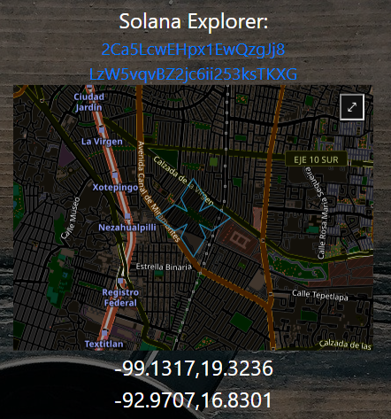

Aqui te dejamos el QR de uno de los productos para que puedas revisarlo tu mismo.

## Rapyd Integration: 

El checkout de Rapyd es una de las partes mas importantes de el marketplace, ya que le da la capacidad de poder realizar pagos con dinero real para poder comprar los productos, en este caso la API que implementamos en la plataforma fue la de poder realizar el Checkout de los productos.

En ese caso la api es ejecutada una vez hemos terminado de seleccionar los productos y presionamos el boton de Checout.

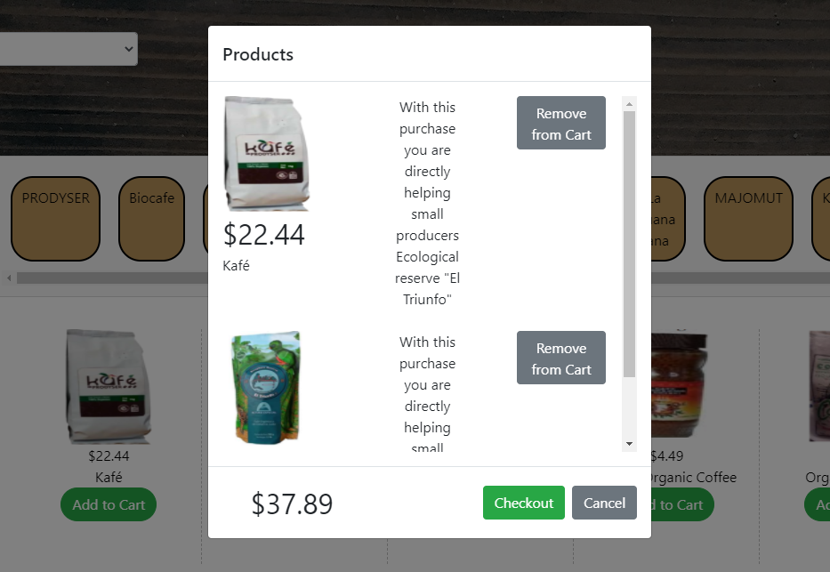

Podemos ver que una vez preisonamos el boton de Checkout nos lleva dorectamente a la plagina de Checkout que nos da Rapyd.

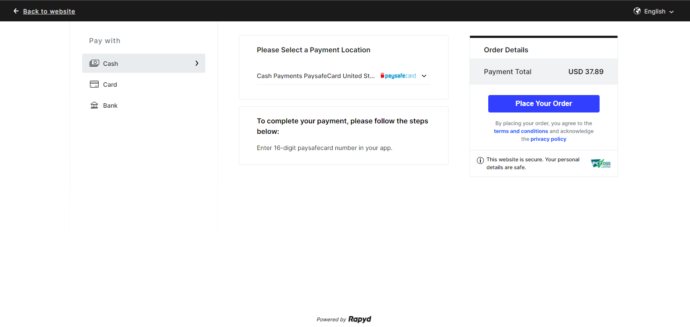

Como parte de la implementacion de Rapyd podemos facilmente seleccionar y agregar todos los metodos de pago que creamos convenientes para nuestro negocio.

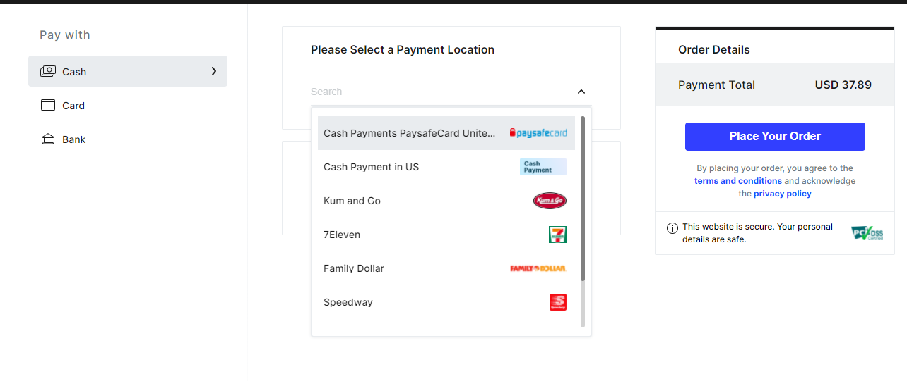

# Deployment/Traction:

DOK